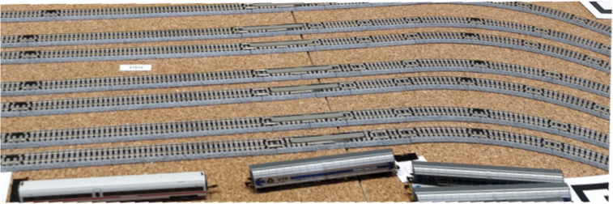
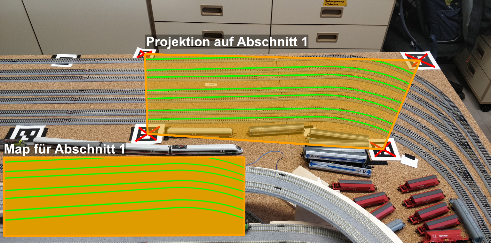
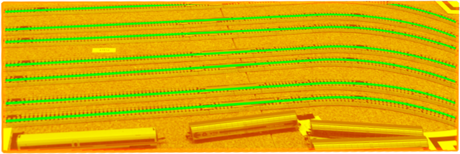
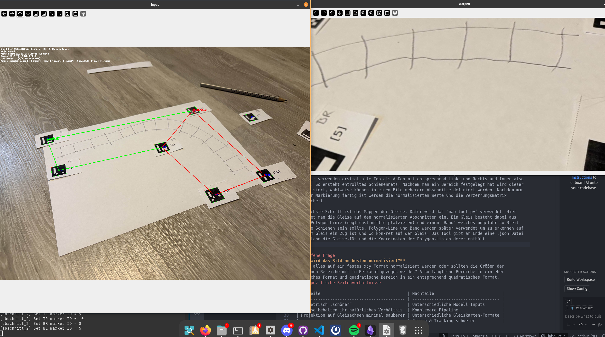
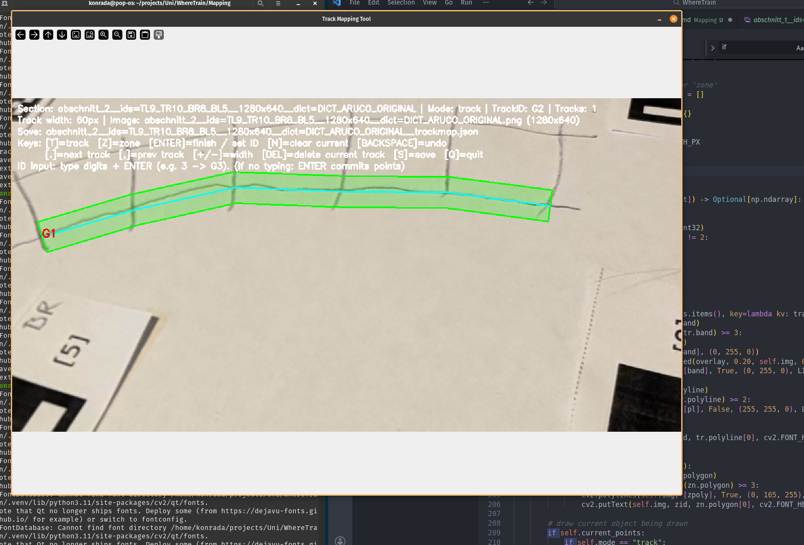

# Umsetzung Gleis - Mapping
Hier kann man sehen wie das Mapping umgesetzt werden soll. Die Marker definieren verschiedene Bereiche (hier beispielhaft benannt "Abschnitt 1"). Mithilfe dieser Marker erstellen wir ein Normalisiertes Bild. Hier rauf wird dann die angewendet.

[^1]

Manuell Mappen wir dann die Gleise für diese Bereiche. So dass auch wir auch mit anderen Kamerapostionen und Orientierungen immer wissen wo die Gleise sich befinden.

[^2]

Nach der [[Objekterkennung der Züge]] wird die Gleiskarte auf das normalisierte Bild projiziert. Für jede erkannte Zugdetektion wird geprüft, mit welchem Gleis-Polygon die größte Überlappung besteht. Der Zug wird anschließend diesem Gleis zugeordnet.

[^3]
## Was konkret ist der Mapping Prozess?
Der Mapping Prozess fängt damit an, dass wir die einzelnen Bereiche (Gleise) mit Markern markieren. Dabei ist es vorteilhaft wenn alle Marker die gleiche Ausrichtung haben.

Dann werden mit dem ´section_tool.py´ die Abschnitte festgelegt z.B "Bahnhof". Diese Bereiche werden über ihre Marker definiert (das Tool ermittelt automatisch welche Marker verwendet werden. Sollten Marker verwendet werden welche das Tool nicht kennt müssen diese dem _DICT_CANDIDATES_ hinzugefügt werden). Dabei sollte man sich auf eine Markierungsstratigie einigen, für jeden Marker kann man festlegen ob der TL - Top Left, TR oder Bl - Bottom Left ist. 

Wir verwenden erstmal alle Top als Außen mit entsprechend Links und Rechts und Innen also Bottom. So ensteht entrolltes Schienennetz. Nachdem man ein Bereich festgelegt hat wird dieser normalisiert, wahlweise können in einem Bild meherere Abschnitte definiert werden. Nachdem man mit der Markierung fertig ist werden die normalisierten Werte und die Verzerrungsmatrix gespeichert.

Der nächste Schritt ist das Mappen der Gleise. Dafür wird das ´map_tool.py´ verwendet. Hier zeichnet man die Gleise auf den normalisierten Abschnitten ein. Ein Gleis besteht dabei aus einer Polygon-Linie (möglichst mittig platzieren) und einem "Band" welches ungefähr so Breit wie die Schienen sein sollte. Polygon-Line und Band werden später verwendet um zu erkennen auf welchem Gleis ein Zug ist und wo konkret auf dem Gleis. Das Tool gibt am Ende eine .json Datei aus welche die Gleise-IDs und die Koordinaten der Polygon-Linien derer enthält.

Eine Dokumentation zur Nutzung der Tools folgt...

### Offene Frage
**Wie wird das Bild am besten normalisiert?**
Sollte alles auf ein festes x:y Format normalisiert werden oder sollten die Größen der einzelnen Bereiche mit in Betracht gezogen werden? Also längliche Bereiche in ein eher längliches Format und quadratische Bereich in ein entsprechend quadratisches Format.
#### Spezifische Seitenverhältnisse

| Vorteile                                    | Nachteile                            |
| ------------------------------------------- | ------------------------------------ |
| Geometrisch „schöner“                       | Unterschiedliche Modell-Inputs       |
| Gleise behalten ihr natürliches Verhältnis  | Komplexere Pipeline                  |
| Projektion auf Gleisachsen minimal sauberer | Unterschiedliche Gleiskarten-Formate |
|                                             | Fusion & Tracking schwerer           |
#### Einheitliches Format (bevorzugt)
Diese Variante wäre leichter um zusetzen 

| Vorteile                                     | Nachteile                                       |
| -------------------------------------------- | ----------------------------------------------- |
| Einfachere Pipeline                          | Verzerrung bei sehr länglichen Bereichen        |
| Einheitliche Modell-Inputs                   | Gleise können „gestaucht“ oder „gezogen“ werden |
| Gleiskarten lassen sich **wiederverwenden**  |                                                 |
| Tracking & Fusion zwischen Kameras einfacher |                                                 |
| Weniger Spezialfälle im Code                 |                                                 |
Mann könnte für gewisse Bereiche Formate festlegen um so starke Verzerrung vorzubeugen.
Wir verwenden **wenige Standardformate** (z. B. 2:1 und 1:1) je nach Abschnittstyp. Das wäre noch relativ leicht umzusetzen. Mit reinspielen würde da wahrscheinlich auch eine kluge Marker Platzierung. 

[^1]: Normalisiertes Bild

[^2]: Mapping Prozess Darstellung

[^3]: Gleis Zuordnung
