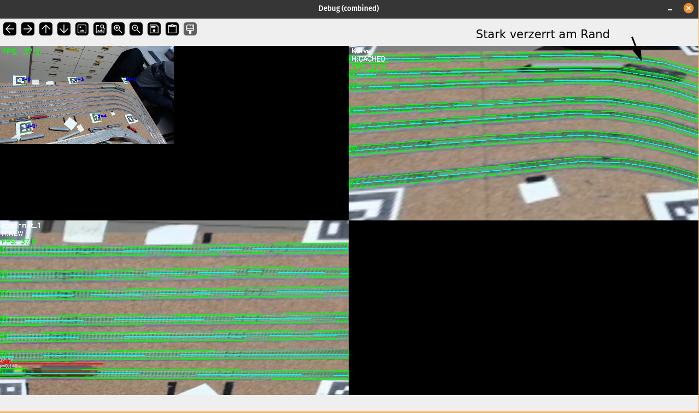

# Where Train?

Ziel dieses Projekts ist es, die Vorarbeit von **Paul Kellner** zur
kontextbezogenen Standortbestimmung von Modellzügen zu erweitern.


Die Arbeit von Paul beantwortet die Frage:

> **„Befindet sich ein Zug innerhalb einer definierten Standortzone (rot)?"**

Unser Projekt erweitert diesen Ansatz wie folgt:

> In der Arbeit von Paul Kellner wird bestimmt, ob sich ein Zug innerhalb einer
> definierten Standortzone befindet. Aufbauend auf diesem Ansatz verfeinern wir
> die Lokalisierung, indem wir die Zone in einzelne Gleise (grün) unterteilen und
> zusätzlich die Position des Zuges entlang eines konkreten Gleises bestimmen (schwarzes Kreuz).
> Dadurch wird aus einer binären Anwesenheitsdetektion eine präzise,
> gleisbasierte Lokalisierung mit Fahrtrichtung.

## Geleistete Vorarbeit

Konzeptionell übernommen von Paul Kellner:
- Nutzung von **ArUco-Markern**
- **Homographie-basierte Kamera-Normalisierung**
- Arbeit auf einem **stabilen, normalisierten Kamerabild**
- **YOLO-basierte** Zugdetektion

Diese Normalisierung bildet die Grundlage für alle weiteren Schritte.

## Unser Part

### Gleisbasierte Lokalisierung

- Modellierung jedes Gleises als Polylinien mit **Bandbreite** (Polygon)
- Zugdetektion per **YOLO** auf GPU mit Batch-Inferenz über alle Sections
- Gleiszuordnung über **maximale Polygon-Überlappung** der BBox mit dem Gleisband

```
Zug → Gleis_3
```

### Position auf dem Gleis

Zusätzlich zur Gleis-ID wird die **Position entlang des Gleises** berechnet:

- Projektion des Zugmittelpunkts auf die Gleisachse (Polyline)
- Ausgabe als normierter Wert (0.0 – 1.0) und lateraler Abstand zur Gleismitte

```
Zug → Gleis_3 → Position = 0.72
```

### Fahrtrichtung

Aus dem zeitlichen Verlauf der Position wird die **Fahrtrichtung** bestimmt:

- Zeitliche Glättung der Rohposition über ein gleitendes Fenster (`SMOOTH_WINDOW`)
- Richtungsentscheidung über Vergleich von ältestem und neuestem geglätteten Wert (`DIRECTION_WINDOW`)
- Ausgabe: `→` vorwärts, `←` rückwärts, `·` stillstehend

```
Zug → Gleis_3 → Position = 0.72 → Richtung: →
```

## runtime.py

Einmalig beim Start:

- ArUco-Dictionary wird automatisch aus dem ersten Frame bestimmt und für alle folgenden Frames wiederverwendet.
- YOLO-Modell wird einmalig auf die GPU geladen.

Pro Frame läuft dieser Ablauf:

1. Marker im Eingabebild erkennen (mit festem Dictionary).
2. Für jeden Abschnitt Homographie aus sichtbaren Marker-Zentren berechnen.
3. Falls Marker kurz fehlen: letzte Homographie pro Abschnitt bis `H_TIMEOUT_SEC` weiterverwenden (Cache in-memory).
4. Alle gewarpten Abschnitte in einem **Batch-GPU-Aufruf** per YOLO detektieren.
5. Jede BBox über maximale Band-Überlappung einem Gleis zuordnen (`MIN_OVERLAP_PX` als Schwellwert).
6. Für zugeordnete Gleise Position entlang der Polyline (`s_norm`), lateralen Abstand und Fahrtrichtung berechnen.

Wichtig: Der Code implementiert kein Distanz-basiertes Tie-Breaking bei gleicher Overlap-Fläche; verwendet wird nur die größte Überlappung. Mit `SHOW_DEBUG = False` lässt sich der Durchsatz deutlich steigern (~50 FPS auf Nvidia GPU).

## Repository-Überblick (Skripte)

| Skript | Zweck | Typischer Einsatz |
| --- | --- | --- |
| `runtime.py` | Führt die komplette Laufzeit-Pipeline aus: Marker erkennen, Abschnitt warpen, Zug detektieren, Detektion auf Gleis mappen, Position und Fahrtrichtung berechnen. | Online/Offline-Demo für den Gesamtablauf mit Webcam, Bild oder Video. |
| `track_state.py` | Zeitliche Glättung der Zugposition und Fahrtrichtungserkennung pro Gleis. | Wird von `runtime.py` importiert. |
| `extract_train_data.py` | Extrahiert normalisierte Trainingsbilder aus Videos (`data/TrainVid*.mp4`) und speichert nur Frames mit genug relevanten Farbanteilen. | Datensatzerstellung für spätere Modell-Trainingsläufe. |
| `Mapping/section_tool.py` | Interaktives Tool zum Definieren von Abschnitten über ArUco-Marker und Export normalisierter Abschnittsbilder. | Erster Schritt beim Setup neuer Kameraperspektiven. |
| `Mapping/map_tool.py` | Interaktives Tool zum Einzeichnen von Gleis-Polylinien und -Bändern auf normalisierten Abschnitten; Export als `__trackmap.json`. | Erstellen oder Pflegen der Gleiskarte pro Abschnitt. |
| `Detection/Color_detcion/detection_with_color.py` | Einfache farbbasierte Zugdetektion (HSV, Morphologie, größte Komponente → BBox). | Prototyp/Baseline ohne trainiertes Modell. |
| `Detection/YOLO/yolo_model.py` | YOLO-basierte Zugdetektion auf GPU, unterstützt Batch-Inferenz über mehrere Sections. | Wird von `runtime.py` importiert. |
| `main.py` | Minimales Platzhalter-Entrypoint-Skript. | Aktuell ohne funktionale Pipeline-Relevanz. |

## Schneller Workflow (empfohlen)

1. Mit `Mapping/section_tool.py` Abschnitte definieren und normalisierte Bilder exportieren.
2. Mit `Mapping/map_tool.py` pro Abschnitt Gleise als Polyline + Band einzeichnen.
3. Mit `runtime.py` die Laufzeit-Pipeline auf Video/Webcam testen.
4. Optional mit `extract_train_data.py` zusätzliche normalisierte Trainingsbilder aus Rohvideos erzeugen.

## Konfiguration

Relevante Konstanten in `runtime.py`:

| Konstante | Standard | Bedeutung |
| --- | --- | --- |
| `SHOW_DEBUG` | `True` | Debug-Fenster mit Overlay anzeigen |
| `PROCESS_EVERY_NTH_FRAME` | `1` | Jeden N-ten Frame verarbeiten |
| `H_TIMEOUT_SEC` | `8.0` | Sekunden bis gecachte Homographie verfällt |
| `MIN_OVERLAP_PX` | `50` | Mindest-Überlappung für Gleiszuordnung |

Relevante Konstanten in `track_state.py`:

| Konstante | Standard | Bedeutung |
| --- | --- | --- |
| `SMOOTH_WINDOW` | `5` | Frames für die Positionsglättung |
| `DIRECTION_WINDOW` | `8` | Frames für die Richtungsentscheidung |
| `DIRECTION_THRESHOLD` | `0.003` | Minimale s_norm-Änderung für Richtungserkennung |

## Mögliche Erweiterungen / Verbesserungen

### Aktuelle Einschränkungen

- Das Schienennetz muss manuell im Bild modelliert werden
- Änderungen der Kameraposition oder Perspektive können die Genauigkeit beeinflussen
- Sollten sich die Marker verschieben, funktioniert das Mapping der Gleise nicht mehr
- YOLO verwendet Axis-Aligned Bounding Boxes — bei schräg liegenden Gleisen könnten Oriented Bounding Boxes (wie in Pauls Arbeit) die Gleiszuordnung verbessern

### Erweiterungsidee

- **Automatische Schienenerkennung**

  - Statt manueller Modellierung könnten die Schienen direkt aus dem Bild segmentiert werden.
> [!NOTE]
> Automatisierte Schienenerkennung:
> [Efficient railway track region segmentation algorithm based on lightweight neural network and cross-fusion decoder - ScienceDirect](https://www.sciencedirect.com/science/article/pii/S0926580523003291)

- **Allgemeine Verbesserungen**
  - Unser Modell war ziemlich schnell gemacht und verwendet keine Oriented BBoxen, für die beste Genaugikeit wäre aber wahrscheinlich ein Segmentierungs oder Maskingmodell am besten
  - Eine sinnvollere Markerplatzierung könnte die Genauigkeit erhöhen und dem Modell helfen Züge besser zu erkennen (der Kamerawinkel ist hier gewollt ungünstig gewählt um Grenzen zu testen) 
  - Allgemein müssten mehr Edge Cases wie diese in die Trainingsdaten aufgenommen werden, um das Modell vielseitiger einsetzten zu können
  - Allgemein kann der Code bestimmt noch verbessert werden. Ohne Debug Overlay sind zwar bis zu 50FPS möglich (nur zwei überwachte bereiche) aber einiges an Potenzial lassen wir noch liegen. 

## Interessante/möglicherweise nützliche Quellen

Automatisierte Schienenerkennung:
[Efficient railway track region segmentation algorithm based on lightweight neural network and cross-fusion decoder - ScienceDirect](https://www.sciencedirect.com/science/article/pii/S0926580523003291)