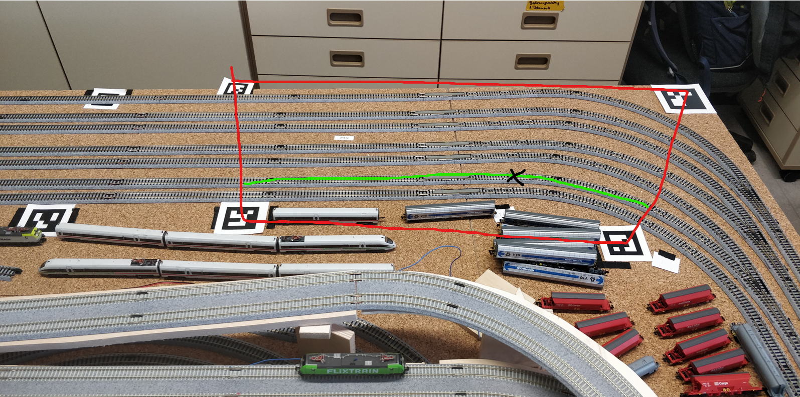

# Where Train?
Ziel dieses Projekts ist es, die Vorarbeit von **Paul Kellner** zur
kontextbezogenen Standortbestimmung von Modellzügen zu erweitern.

Die Arbeit von Paul beantwortet die Frage:

> **„Befindet sich ein Zug innerhalb einer definierten Standortzone (rot)?“**

Unser Projekt erweitert diesen Ansatz wie folgt:

> In der Arbeit von Paul Kellner wird bestimmt, ob sich ein Zug innerhalb einer
> definierten Standortzone befindet. Aufbauend auf diesem Ansatz verfeinern wir
> die Lokalisierung, indem wir die Zone in einzelne Gleise (grün) unterteilen und
> zusätzlich die Position des Zuges entlang eines konkreten Gleises bestimmen (schwarzes Kreuz).
> Dadurch wird aus einer binären Anwesenheitsdetektion eine präzise,
> gleisbasierte Lokalisierung.

### Geleistete Vorarbeit
- Zugriff auf das GitLab-Repository von Paul Kellner ist vorgesehen  
  (aktuell noch Anmeldeprobleme, Zugriff sehr wahrscheinlich)
- Unabhängig vom Zugriff übernehmen wir **konzeptionell**:
  - Nutzung von **ArUco-Markern**
  - **Homographie-basierte Kamera-Normalisierung**
  - Arbeit auf einem **stabilen, normalisierten Kamerabild**

Diese Normalisierung bildet die Grundlage für alle weiteren Schritte.
## Unser Part
### Gleisbasierte Lokalisierung
- Arbeiten ausschließlich auf dem **normalisierten Bild**
- Modellierung jedes Gleises als:
  - schmale Polygonfläche oder *Polygonlinie*
- Detektierte Züge:
  - Bounding Boxes (Baseline)
  - optional: Segmentationsmasken (für höhere Genauigkeit)
**Zuordnung:**
- Für jede Detektion wird geprüft, **mit welchem Gleispolygon die größte
  Überlappung besteht**
- Der Zug wird diesem Gleis zugeordnet
```
Zug → Gleis_3
```
[[Umsetzung Gleis - Mapping]]
### Position auf dem Gleis
Zusätzlich zur Gleis-ID bestimmen wir die **Position entlang des Gleises**:

- Projektion der Zugposition auf die Gleisachse
- Darstellung als:
  - Pixelposition oder
  - normierter Wert (z. B. 0.0 – 1.0)
```
Zug → Gleis_3 → Position = 0.72
```
## Mögliche Erweiterungen / Verbesserungen
### Aktuelle Einschränkung
- Das Schienennetz muss manuell im Bild modelliert werden
- Änderungen der Kameraposition oder Perspektive können die Genauigkeit
  beeinflussen
### Erweiterungsidee: Automatische Schienenerkennung
Statt manueller Modellierung könnten die Schienen direkt aus dem Bild segmentiert werden.
> [!NOTE]
> Automatisierte Schienen Erkennung
> [Efficient railway track region segmentation algorithm based on lightweight neural network and cross-fusion decoder - ScienceDirect](https://www.sciencedirect.com/science/article/pii/S0926580523003291)

## Interessante/möglicherweise nützliche Quellen
Automatisierte Schienen Erkennung:
[Efficient railway track region segmentation algorithm based on lightweight neural network and cross-fusion decoder - ScienceDirect](https://www.sciencedirect.com/science/article/pii/S0926580523003291)

